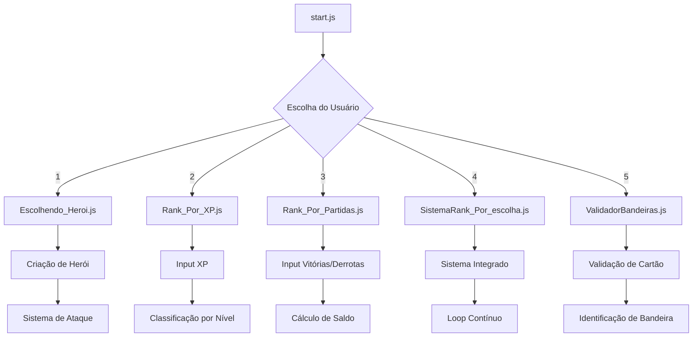

# 🎮 Desafio Felipão - Coleção de Sistemas Interativos

## 📋 Sobre o Projeto

O **Desafio Felipão** é uma coleção de sistemas interativos desenvolvidos em Node.js que demonstra diferentes conceitos de programação, desde criação de classes e objetos até validação de dados complexos. O projeto inclui 5 módulos distintos, cada um focado em uma funcionalidade específica.

## 🏗️ Arquitetura do Sistema

O projeto foi estruturado de forma modular, onde cada arquivo representa um sistema independente que pode ser executado individualmente ou através de um menu interativo centralizado.

### 📁 Estrutura de Arquivos

```
desafio-felipao/
├── 📜 start.js                    # Menu principal interativo
├── 🦸 Escolhendo_Heroi.js         # Sistema de criação de heróis
├── 📊 Rank_Por_XP.js              # Classificação por experiência
├── 🏆 Rank_Por_Partidas.js        # Classificação por vitórias/derrotas
├── 🎯 SistemaRank_Por_escolha.js  # Sistema completo integrado
├── 💳 ValidadorBandeiras.js       # Validador de cartões de crédito
├── 📋 numerosTeste.js             # Base de dados de testes
├── 🌐 servidor-web.js             # Servidor web para interface
├── 📄 package.json                # Configurações do projeto
├── 📚 README files                # Documentação
└── 🌐 web/                        # Interface web
    ├── index.html                 # Página principal
    ├── css/style.css              # Estilos
    ├── js/main.js                 # JavaScript
    └── pages/                     # Páginas adicionais
        └── validador.html         # Validador interativo
```

## 🌐 Interface Web

O projeto agora inclui uma **interface web moderna** além das interações via linha de comando:

### 🎨 Recursos da Interface Web:
- **Dashboard interativo** com todos os módulos
- **Validador de cartões online** com interface visual
- **Documentação integrada** e exemplos de código
- **Design responsivo** para mobile e desktop
- **Terminal simulado** com comandos copiáveis

### 🚀 Como Acessar:
```bash
npm run web          # Inicia o servidor
# Acesse: http://localhost:3000
```

### 📱 Funcionalidades Web:
- ✅ Visualização de todos os módulos
- ✅ Validador de cartões interativo
- ✅ Exemplos de código em tempo real
- ✅ Documentação navegável
- ✅ Interface mobile-friendly
- ✅ **Linha de comando continua funcionando normalmente!**

## 🎯 Módulos do Sistema

### 1. 🦸 Sistema de Heróis (`Escolhendo_Heroi.js`)
- **Propósito**: Demonstra programação orientada a objetos
- **Funcionalidades**: 
  - Criação de heróis com nome, idade e tipo
  - Sistema de ataques baseado no tipo do herói
  - 4 tipos disponíveis: Mago, Guerreiro, Monge, Ninja
- **Conceitos**: Classes, construtores, métodos, switch case

### 2. 📊 Ranking por XP (`Rank_Por_XP.js`)
- **Propósito**: Sistema de classificação baseado em experiência
- **Funcionalidades**:
  - Classificação automática por níveis de XP
  - 10 níveis diferentes (Ferro a Radiante)
  - Sistema de progressão de heróis
- **Conceitos**: Estruturas condicionais, lógica de negócio

### 3. 🏆 Ranking por Partidas (`Rank_Por_Partidas.js`)
- **Propósito**: Sistema de classificação por desempenho em batalhas
- **Funcionalidades**:
  - Cálculo de saldo de vitórias (vitórias - derrotas)
  - Classificação baseada em número de vitórias
  - 8 níveis de classificação
- **Conceitos**: Operações matemáticas, lógica condicional

### 4. 🎯 Sistema Completo (`SistemaRank_Por_escolha.js`)
- **Propósito**: Integração de múltiplas funcionalidades
- **Funcionalidades**:
  - Combinação dos sistemas de XP e partidas
  - Interface interativa para múltiplas consultas
  - Loop de execução contínua
- **Conceitos**: Integração de sistemas, loops, validação de entrada

### 5. 💳 Validador de Bandeiras (`ValidadorBandeiras.js`)
- **Propósito**: Validação avançada de cartões de crédito
- **Funcionalidades**:
  - Suporte a 11 bandeiras diferentes
  - Algoritmo de Luhn para validação matemática
  - Verificação de prefixos e formatos específicos
  - Sistema de mascaramento para segurança
- **Conceitos**: Regex, algoritmos, validação de dados, segurança

## 🚀 Como Executar o Sistema

### Instalação
```bash
# Instalar dependências
npm install
```

### 🌐 Interface Web (Nova!)
```bash
# Iniciar servidor web
npm run web
# ou
npm run dev

# Acesse: http://localhost:3000
```

### 💻 Linha de Comando (Original)

#### 🎮 Menu Principal (Recomendado)
```bash
npm start
```
Inicia o menu interativo que permite escolher qualquer módulo.

#### 🎯 Execução Individual
```bash
# Sistema de Heróis
npm run heroi

# Ranking por XP
npm run rank-xp

# Ranking por Partidas
npm run rank-partidas

# Sistema Completo
npm run sistema-completo

# Validador de Bandeiras
npm run validador
```

#### 🔧 Execução Direta
```bash
# Executar qualquer módulo diretamente
node NomeDoArquivo.js
```

## 🛠️ Tecnologias Utilizadas

- **Node.js**: Runtime JavaScript
- **ES6 Modules**: Sistema de módulos moderno
- **readline-sync**: Interface interativa de linha de comando
- **JavaScript ES6+**: Classes, arrow functions, template literals
- **Regex**: Validação de padrões complexos
- **Algoritmos**: Luhn, classificação, cálculos matemáticos

## 📚 Conceitos Demonstrados

### Programação Orientada a Objetos
- Classes e construtores
- Métodos e propriedades
- Encapsulamento de dados

### Estruturas de Controle
- Condicionais (if/else, switch)
- Loops (while, for, forEach)
- Validação de entrada

### Manipulação de Dados
- Arrays e objetos
- String manipulation
- Regex patterns
- Algoritmos de validação

### Interface do Usuário
- Menu interativo
- Formatação de saída
- Feedback visual com emojis
- Mascaramento de dados sensíveis

## 🎯 Objetivos Educacionais

Este projeto demonstra:

1. **Modularização**: Como organizar código em módulos independentes
2. **Reutilização**: Aproveitamento de funções e classes
3. **Validação**: Técnicas de validação de dados
4. **Experiência do Usuário**: Interface amigável e intuitiva
5. **Boas Práticas**: Código limpo e bem documentado
6. **Segurança**: Tratamento seguro de dados sensíveis

## 📊 Fluxo do Sistema



## 🤝 Contribuições

Este projeto está aberto para melhorias e novas funcionalidades. Algumas ideias para expansão:

- Sistema de persistência de dados
- Interface web
- API REST
- Novos tipos de validação
- Sistema de autenticação
- Dashboard de estatísticas

## 📝 Licença

ISC License - Projeto educacional para demonstração de conceitos de programação.

---

**Desenvolvido como parte dos desafios de programação Felipão** 🎮
